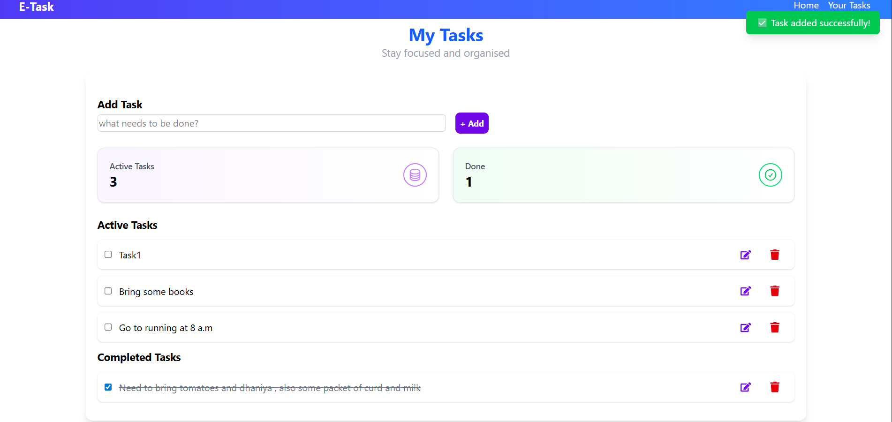

# E-Task: React Todo App

A simple, responsive **Todo App** built with **React** and **Vite**, featuring task management, completion tracking, and local storage persistence. Perfect for learning modern frontend practices.

---

## 🚀 Features

- Add, Edit, Delete tasks 📝  
- Mark tasks as completed ✅ and auto-move to Completed section  
- Persistent storage using **localStorage**  
- Responsive design for desktop and mobile 📱  
- Interactive emoji icons for edit (✏️), delete (❌), and complete (✅)  
- Smooth task addition notification  

---

## 🎨 Technologies Used

- **React** (Functional Components & Hooks)  
- **Vite** (Fast Development Server)  
- **Tailwind CSS** (Styling)  
- **uuid** (Unique IDs for tasks)  
- **Local Storage** (Data persistence)  

---

## 📦 Installation

## 📸 Screenshot

